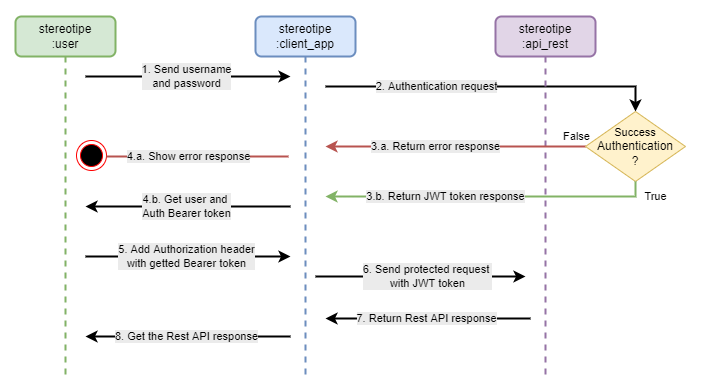

# Laravel API Backend with JWT practice

This project explain how to use Laravel and JWT to protect Rest API requests using best practices and showing how to create a maintainable and scalable project using clean architectures, SOLID principles and Rest API best practices.

## Installed packages
- [tymon/jwt-auth](https://github.com/tymondesigns/jwt-auth)
- [laraveles/spanish](https://github.com/Laraveles/spanish)

## Coding/developing requirements
- Composer 2+ with environment variable configured
- PHP 8.1+/8.2+ with environment variable configured
- MySQL/MariaDB database or PostgreSQL database with environment variable configured
    - Create new ***jwt_laravel_practice*** database
- Postman for API Rest requests testing 

Each migration and seed was developed to evaluate whether or not the resource exists and if it does not exist, create it. This way errors are avoided when executing migrations.

## Installation
1. Clone the project and go to Backend_Laravel directory
2. Run this commands:
    - composer install
    - php artisan key:generate
    - php artisan storage:link
    - php artisan migrate:fresh --seed
    - php artisan vendor:publish --provider="Tymon\JWTAuth\Providers\LaravelServiceProvider"
    - php artisan jwt:secret
    - php artisan vendor:publish --tag=lang
    - npm install
    - npm run build

## Updating code after git pull code from repository
- If you are using Windows, go to Backend_Laravel root directory and execute **bin\update.bat** command, this will install all composer and npm dependencies, run migrations and seeders and transpile vite settings.
- If you are using Linux/Mac, go to Backend_Laravel root directory and execute **bin\update.sh** command, this will install all composer and npm dependencies, run migrations and seeders and transpile vite settings.

## JWT requests lifecycle

1. JWT is requested by user via client app sending username and password
2. Client app start authentication request
3. Start authentication request:
    - If authentication fail return error response
    - If authentication success return JWT token
4. Return response to client:
    - If authentication fail show error response to user
    - If authentication success user get user data and JWT token to be used in protected request
5. User add Authorization Bearer token header, Content-Type and Accept application/json headers to protected request.
6. Client app send the protected request with required headers.
7. Rest API server return response
8. Client get the Rest API response

## Rest API documentation
Rest API documentation is available on my postman workspaces and you can find practice requests in [https://documenter.getpostman.com/view/2915198/2s9YeBdtJK](https://documenter.getpostman.com/view/2915198/2s9YeBdtJK)

## Credits

Author: *Epsom Segura*

######  Contact < [Linkedin](https://www.linkedin.com/in/epsomsegura) - [Facebook](https://www.facebook.com/EpsomSegura/) - [Youtube](https://www.youtube.com/@epsomsegura) >
